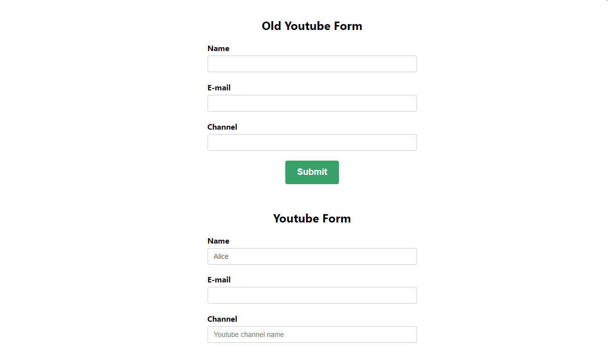

<h1 align="center">
  
</h1>

# React-Formik

O projeto consiste em apresentar um conjunto de formulários, utilizando o Formik e outras bibliotecas, tais como o Yup e Chakra UI.

O Formik é a biblioteca de formulários.

A API Yup é um construtor de esquema JavaScript para análise e validação de valor. Ela permite modelar validações complexas e interdependentes.

Chakra UI é uma biblioteca de componentes simples e customizáveis.

<p align="center">
 <a href="#tecnologias">Tecnologias</a> • 
 <a href="#pré-requisitos">Pré-requisitos</a> •
 <a href="#rodando-o-projeto">Rodando o projeto</a>
</p>

## Tecnologias

As seguintes ferramentas/bibliotecas foram usadas na construção do projeto:

- [Node.js](https://nodejs.org/en/)
- [React](https://pt-br.reactjs.org/)
- [Formik](https://formik.org/)
- [Yup](https://www.npmjs.com/package/yup)
- [Chakra-ui](https://v0.chakra-ui.com/getting-started)
- [React-Datepicker](https://www.npmjs.com/package/react-datepicker)

## Pré-requisitos

- [Git](https://git-scm.com)
- [Node.js](https://nodejs.org/en/)
- um editor de código, como o [VSCode](https://code.visualstudio.com/)

## Rodando o projeto

```bash
# Clone este repositório
$ git clone <https://github.com/Alice7H/react-formik.git>

# Acesse a pasta do projeto no terminal/cmd
$ cd react-formik

# Instale as dependências
$ npm install
#ou
$ yarn install

# Execute a aplicação em modo de desenvolvimento
$ npm start
#ou
$ yarn start

# O projeto inciará na porta:3000 - acesse <http://localhost:3000>
```
